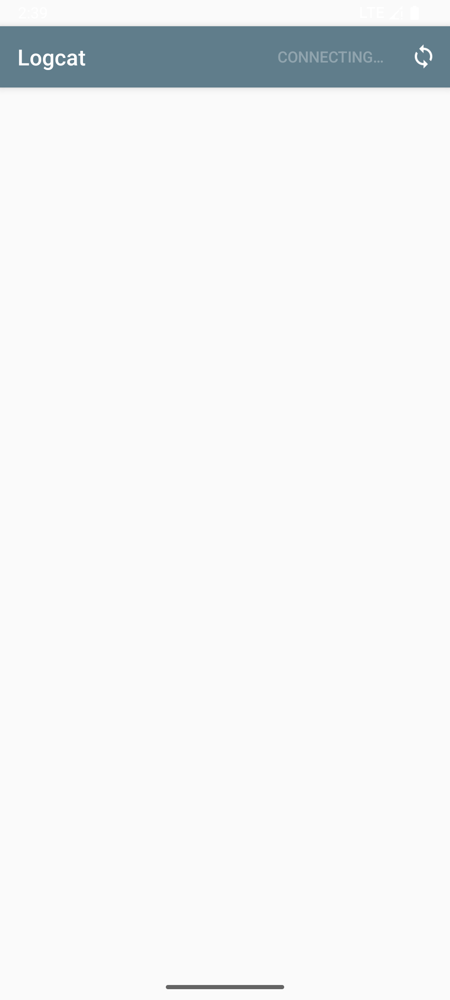
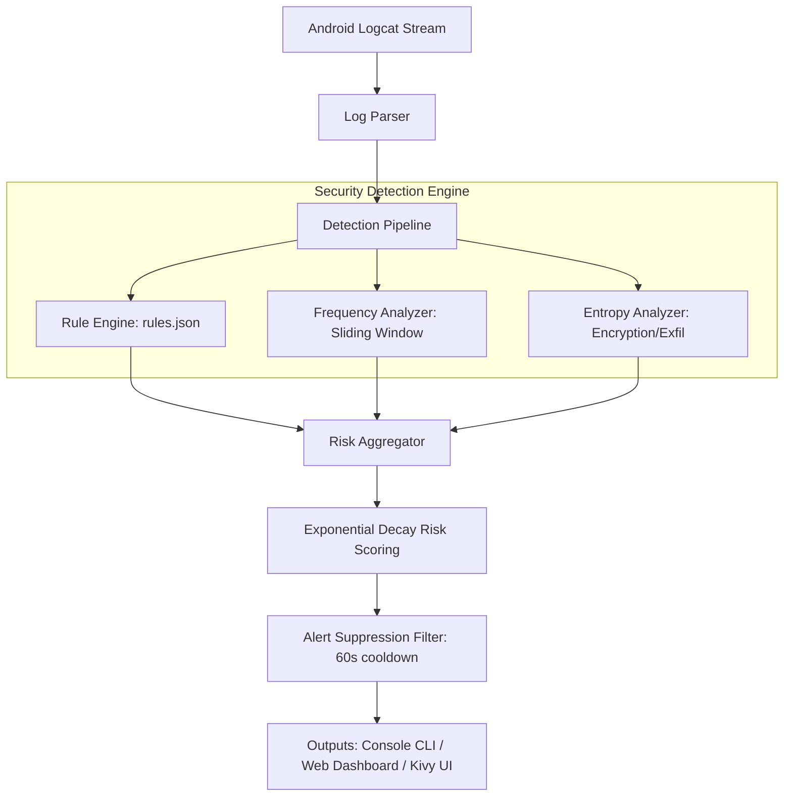

# 🛡️ Security Monitor: Android Logcat Threat Detection Suite

A professional-grade, lightweight real-time security monitor that analyzes raw Android logcat streams to detect suspicious activity, malware behaviors, hooking frameworks, and system anomalies. 

Designed to run **locally on Android devices** (as a native Kivy app) or **remotely via a PC (CLI & Web Dashboard)**, this tool operates completely **without root access**, utilizing standard Android logging interfaces.

---

## 🚀 Key Features

*   **Dual-Deployment Modes**:
    *   📱 **Android Native App**: Built with Kivy and packaged via Buildozer. Runs directly on your phone, streams local logcat logs, and hosts a local Flask-based web dashboard.
    *   💻 **PC CLI & Web Dashboard**: Connects to any Android device via ADB (USB or Wi-Fi TCP/IP). Displays colored terminal alerts and serves a web dashboard.
*   **Multi-Signal Detection Engine**:
    *   📋 **Rule-Based Engine**: Custom signatures to identify root attempts, hooking frameworks (Frida/Xposed), certificate pinning bypasses, data exfiltration, background camera/mic triggers, etc.
    *   📊 **Frequency Anomaly Detection**: Tracks event frequency per log tag in a sliding 60-second window to flag process spikes and log storms.
    *   🔒 **Entropy Analysis**: Measures Shannon entropy of log messages to flag encrypted payloads, base64 strings, or data exfiltration.
*   **Aggregated Threat Risk Scoring**: Computes a dynamic safety score (0–100) using exponential age-decay. Risk levels auto-adjust across **LOW**, **MEDIUM**, and **HIGH**.
*   **Web Dashboard**: Fully interactive, auto-refreshing UI showing a timeline of security events, severity levels, triggering engines, and raw payload details.
*   **No Root Required**: Connects to the ADB daemon or uses Android's local log daemon.

---

## 📸 Screenshots

| 💻 Web Dashboard Threat Feed | 📱 Android App Interface |
| :---: | :---: |
|  |  |

---

## 🛠️ Architecture Overview

The application utilizes a pipeline architecture to capture, analyze, and report potential security threats in near-zero latency:



---

## 📦 Getting Started

### Mode A: Run as a Native Android App (No PC Required)

To run the security monitor directly on your Android phone, follow these steps:

#### 1. Package and Install the App
Compile the project into a native APK using Buildozer:
```bash
buildozer -v android debug
```
Install the generated APK (`bin/securitymonitor-fixed.apk`) on your device.

#### 2. Grant Logcat Permissions (One-time Setup)
Android restricts third-party apps from reading system logs for security reasons. To allow Security Monitor to access the logcat stream, connect your phone to a PC once and run:
```bash
adb shell pm grant com.aryanchauhan.securitymonitor android.permission.READ_LOGS
```

#### 3. Launch and Monitor
1. Open **Security Monitor** on your phone.
2. Tap **Start Monitoring Service**.
3. Once the status shows `Active / Running`, tap **Open Web Dashboard**.
4. The app will open your mobile browser at `http://127.0.0.1:5000/` showing the live security dashboard of your phone!

---

### Mode B: Run on PC (Remote Monitoring via ADB)

#### 1. Prerequisites
- Python 3.10+
- `adb` configured in your system `PATH`
- Install dependencies:
  ```bash
  pip install -r requirements.txt
  ```

#### 2. Configure USB Debugging
- Enable developer options on your Android device (Settings → About Phone → Tap "Build Number" 7 times).
- Go to Settings → Developer Options and turn on **USB Debugging**.

#### 3. Run the CLI Monitor
```bash
# Connect phone via USB, then run:
python monitor.py

# Launch monitoring with the Flask web dashboard
python monitor.py --web

# Analyze a saved batch log file
python monitor.py --file path/to/logcat.txt

# Target a specific device (e.g., when connected over TCP/IP)
python monitor.py --device 192.168.1.50:5555
```

---

## 🔍 Built-in Security Detection Rules

The rule signatures are loaded dynamically from [rules.json](rules.json). You can easily customize or add new rules without writing any code.

| Rule ID | Detection Rule | Target Field | Severity | Risk Weight | Description / Threat Profile |
| :---: | :--- | :---: | :---: | :---: | :--- |
| **RULE_001** | Root Access Attempt | Message/Tag | `HIGH` | 85 | Detects execution of `su` binary or root privilege requests. |
| **RULE_002** | Frida / Xposed Hooks | Message/Tag | `CRITICAL` | 95 | Flags runtime memory instrumentation, hooking utilities, or Magisk. |
| **RULE_003** | Unknown App Install | Message/Tag | `MEDIUM` | 65 | Detects sideloading or installation of untrusted applications. |
| **RULE_004** | Cert Pinning Bypass | Message/Tag | `HIGH` | 80 | Flags overrides of `X509TrustManager` or custom socket connections. |
| **RULE_005** | Background Camera/Mic | Message/Tag | `HIGH` | 78 | Identifies background processes accessing recording devices. |
| **RULE_006** | ADB Command Abuse | Message/Tag | `HIGH` | 75 | Logs unexpected package manager changes or commands executed via ADB. |
| **RULE_007** | Rapid SMS Sending | Message/Tag | `HIGH` | 80 | Flags potential SMS trojans or automated smishing activity. |
| **RULE_008** | Background GPS Spams | Message/Tag | `MEDIUM` | 60 | Detects stealthy background coordinate requests. |
| **RULE_009** | Crypto Mining Indicators | Message/Tag | `MEDIUM` | 65 | Flags Monero mining pools, Stratum protocols, or hash rates. |
| **RULE_010** | Ransomware Encryption | Message/Tag | `HIGH` | 88 | Identifies fast AES file encryption sequences or mass renaming. |
| **RULE_011** | Network Data Exfiltration | Message/Tag | `HIGH` | 72 | Highlights large HTTP uploads or base64 data posts to unusual endpoints. |
| **RULE_012** | Security Exception Storm | Message/Tag | `MEDIUM` | 45 | Detects high-frequency crash loops or authorization faults. |

---

## 📐 Threat Risk Scoring & Decay

The risk scoring model provides a real-time health indicator by summing active threat scores and decaying them exponentially as they age.

$$\text{Score} = \min\left(100, \sum_{i} (\text{Event Score}_i \times \text{Engine Weight} \times e^{-\lambda \times \Delta t_i})\right)$$

Where:
*   **Engine Weight**: `RULE` = 1.0, `FREQ` = 0.7, `ENTROPY` = 0.75
*   **Decay Lambda ($\lambda$)**: `0.005` (half-life of approximately 140 seconds)
*   **Window**: Events older than 300 seconds (5 minutes) are fully evicted.

### Threat Levels:
- 🟢 **LOW**: `0 - 29`
- 🟡 **MEDIUM**: `30 - 69`
- 🔴 **HIGH**: `70 - 100`

---

## 📁 Project Structure

```
Security-Monitor/
├── .github/          # GitHub CI/CD and workflows
├── bin/              # Compiled Android packages (Git-ignored)
├── main.py           # Native Android Kivy entry point
├── monitor.py        # Core python CLI and detection engines
├── rules.json        # Rules database (dynamic JSON)
├── requirements.txt  # Python package dependencies
├── .gitignore        # Standard Git ignore configurations
└── README.md         # Documentation
```

---

## ⚖️ License

This project is licensed under the Apache License, Version 2.0. See the `LICENSE` file for details.
